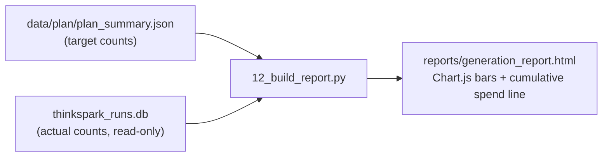

## Run it in a second terminal

While [data generation](/commands/data-generation) is running in one terminal, open a
**second** terminal and run:

```bash
python scripts/11_monitor.py --config configs/data_gen.yaml
```

It only **reads** the SQLite DB (`data/thinkspark_runs.db`) — never writes, safe to run
alongside the generator at any concurrency. Refreshes every 5 seconds by default.

```bash
python scripts/11_monitor.py --interval 10     # slower refresh
python scripts/11_monitor.py --once            # single snapshot, exit
```

## What it shows

<CardGroup cols={2}>
  <Card title="Scenarios done" icon="list-check">
    Valid scenarios vs. target (from the plan), remaining count.
  </Card>
  <Card title="Unit-level eval (§8.5)" icon="check-double">
    Every scenario checked the instant it's produced — pass/fail counts, job-scoped
    `fail1`/`fail2`/… retry tags, worst-retries seen, last 5 failures.
  </Card>
  <Card title="Pass / fail (calls)" icon="list-check">
    LLM call status breakdown (`ok` / `api_error` / `parse_error` / `all_invalid`) + the
    last few actual error messages.
  </Card>
  <Card title="Latency" icon="stopwatch">
    Mean / p50 / p95 per LLM batch call and per TTS call, plus an estimated
    seconds-per-scenario.
  </Card>
  <Card title="Throughput + ETA" icon="gauge-high">
    Scenarios/minute over a recent window, minutes remaining to target.
  </Card>
  <Card title="Cost spent so far" icon="indian-rupee-sign">
    LLM + TTS, in USD and INR.
  </Card>
  <Card title="Projected total & remaining" icon="chart-line">
    Extrapolated from the observed cost-per-scenario rate against the plan's target, and
    checked against `budget_inr_target` (default ₹5000).
  </Card>
</CardGroup>

## Example output

```
========================================================================
 ThinkSpark-v2-350M — data generation monitor   (refreshed 15:03:35)
========================================================================

[UNIT-LEVEL EVAL]  (§8.5 check on each generated scenario, immediately)
  checked        : 3120   passed=2984  failed=136   pass_rate=95.6%
  worst retries  : fail3  (highest fail-count reached by any single job before it succeeded)
  recent fails   :
    - [fail1] barge_real|hi|bfsi_collections|male|0: target[0]: unknown flag 'X'

[LLM GENERATION]  model=deepseek-v3-flash  batch_size=12  concurrency=30
  scenarios      : 3120 / 9000 valid (34.7%)   remaining=5880
  calls          : 340 total   ok=318  failed=22   pass_rate=91.8%
  by status      : {'ok': 318, 'api_error': 12, 'all_invalid': 10}
  tokens         : 285600 in / 550800 out
  latency (ms)   : mean=1612  p50=1590  p95=2200   ~0.13s/scenario
  throughput     : 346.0 scenarios/min   ETA=17.0 min
  cost so far    : $2.14
  projected cost : $6.17

[TTS RENDERING]  target=55.0h
  audio hours    : 12.6 / 55.0 h (22.9%)
  calls          : 640 total   ok=636  failed=4
  latency (ms)   : mean=700  p50=718  p95=743
  cost so far    : $8.82
  projected cost : $38.50

[BUDGET]  target = INR 5000
  spent so far      : $10.96  (~INR 910)   18.2% of budget
  projected total   : $44.67  (~INR 3708)   74.2% of budget
  projected remaining: $33.71  (~INR 2798)
```

<Warning>
If `projected total` is trending past your budget, stop and adjust **before** you
generate the rest — lower `total_hours`, raise `batch_size` for throughput (carefully,
see [Data theory](/literature/data-theory) on batching risk), or switch to a cheaper
generation model in `configs/data_gen.yaml`.
</Warning>

## Chart report (like kupe-tts)

For a shareable, self-contained HTML view — same dark-theme + Chart.js convention as
`kupe-tts`'s cost-EDA reports — with stat cards, a cumulative-spend line chart, and
**actual-vs-planned-target bar charts by behaviour and by language**:

```bash
python scripts/12_build_report.py --config configs/data_gen.yaml
```

Writes `reports/generation_report.html` — open it in any browser. The behaviour/language
bar charts are the fastest way to confirm the corpus is still exactly the balanced
distribution Section 8.1–8.2 planned, not drifting as generation proceeds:

<Frame caption="Actual (colored) vs. target (gray) bars, straight from the plan's own numbers">

</Frame>

Safe to run anytime, including mid-generation — it only reads the DB + `plan_summary.json`,
never the distribution/validation logic itself, so the report can never disagree with what
was actually planned and produced.

## What's actually tracked in SQLite

`data/thinkspark_runs.db` (WAL mode, safe for concurrent readers) isn't just a cost log —
every scenario that's actually generated is recorded there too, not only in the JSONL
shard:

| Table | One row per | Used for |
|---|---|---|
| `runs` | script invocation | run history, config snapshot |
| `llm_calls` | LLM request (a batch) | tokens, cost, latency, status |
| `tts_calls` | Soniox TTS request | audio duration, cost, latency, `status` (`ok`/`error`/`rate_limited`) |
| `unit_evals` | **generated scenario** | Section 8.5 pass/fail + `fail1`/`fail2`/… tag |
| `scenario_registry` | **scenario written to the shard** | scenario_id + its `global_index` — the SQLite-side record of "what was generated", queryable by `--range` slice |

```sql
-- how many of global range [3000,6000) are actually done?
SELECT COUNT(*) FROM scenario_registry WHERE global_index >= 3000 AND global_index < 6000;
```

<Note>
The JSONL shard (`data/scenarios/scenarios_all.jsonl`) stays the **content** source of
truth and what generation resumes from — that never changes, so a corrupted or deleted
DB never loses generated data. `scenario_registry` is the SQLite mirror of "what got
generated", kept in sync automatically (`db.log_scenario()` fires right alongside the
shard write, inside `generate_batch()`), useful for querying progress by range or by job
straight from SQL instead of re-parsing the file.
</Note>

## Export a permanent CSV record

```bash
python scripts/10_export_costs.py --config configs/data_gen.yaml
```

Writes `reports/cost_report.csv` — one row per LLM call and per TTS call, across **every**
resumed session, with tokens, cost, latency, and status. Safe to run mid-generation.

<Card title="Full command reference" icon="list" href="/commands/cheatsheet">
  Every command in this project, on one page.
</Card>
