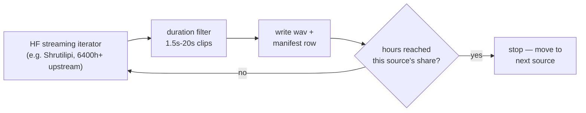

Phase 1 teaches Gemma-3-270M that a stream of Mimi audio tokens carries language +
prosody — see [Data theory](/literature/data-theory) for the full "why 100h isn't
enough" argument. This page is the concrete answer to **where does the data come
from**: real, verified, free sources, streamed on demand by
`scripts/P1_01_fetch_corpus.py`.

## The plan

| Language | Target hours | Sources (share of target) |
|---|---|---|
| English | 150h | Common Voice 17 (60%) + FLEURS (40%) |
| Hindi | 150h | Kathbath (35%) + Shrutilipi (30%) + Common Voice 17 (25%) + FLEURS (10%) |
| Gujarati | 130h | Kathbath (35%) + Shrutilipi (30%) + Common Voice 17 (20%) + IndicTTS-Gujarati (15%) |

**Total ≈ 430h**, matching the guide's "en 150h + hi 150h + gu 100-150h ≈ 400-450h"
practical target (Section 7.1) — 100h across three languages (the original v1 number)
is too thin to be robust; this is the re-derived, real number.

## Why each source is in the mix

<AccordionGroup>
  <Accordion title="Mozilla Common Voice 17">
    [mozilla-foundation/common_voice_17_0](https://huggingface.co/datasets/mozilla-foundation/common_voice_17_0) —
    huge crowd-sourced speaker/gender/accent diversity. Has an **explicit gender
    field**, which is the main lever for the 50/50 gender balance Section 7.3 asks for
    (Phase-1 audio being gender-skewed biases endpointing toward whichever f0 range
    dominates). **Gated** — click "Agree" once on the dataset page before your
    `HF_TOKEN` can pull it.
  </Accordion>
  <Accordion title="AI4Bharat Kathbath">
    [ai4bharat/Kathbath](https://huggingface.co/datasets/ai4bharat/Kathbath) — 1684h
    across 12 Indian languages, read + spontaneous speech from 1218 contributors in
    203 districts. CC0. This is the "Indian speakers, read+spontaneous" line from
    Section 7.2's source table.
  </Accordion>
  <Accordion title="AI4Bharat Shrutilipi">
    [ai4bharat/Shrutilipi](https://huggingface.co/datasets/ai4bharat/Shrutilipi) —
    6400h+ mined from All India Radio news bulletins across 12 languages. Natural,
    unscripted prosody — exactly the "mined news audio, natural prosody" role from
    Section 7.2.
  </Accordion>
  <Accordion title="Google FLEURS">
    [google/fleurs](https://huggingface.co/datasets/google/fleurs) — small, very
    clean. Doubles as a natural **held-out eval set** (Section 10's evaluation
    corpus can draw from the same FLEURS slice never used in training).
  </Accordion>
  <Accordion title="IndicTTS (SPRINGLab, IIT-Madras)">
    [SPRINGLab/IndicTTS_Gujarati](https://huggingface.co/datasets/SPRINGLab/IndicTTS_Gujarati) —
    studio-quality clean baseline, the "IIT-M IndicTTS" line from Section 7.2. Gujarati
    is the scarcest of the three languages, so this adds a clean anchor on top of the
    noisier Kathbath/Shrutilipi/Common Voice mix.
  </Accordion>
</AccordionGroup>

<Note>
Not in the default mix: [ARTPARK-IISc/Vaani](https://huggingface.co/datasets/ARTPARK-IISc/Vaani) —
31,255h across 165 districts and 106 languages, Section 7.2's "district-level accent
spread" entry. It's enormous relative to what Phase-1 needs, so it's left out by default
to keep Kaggle bandwidth/disk bounded. Add it as an extra `sources:` entry in
`configs/phase1_corpus.yaml` with a small `weight` (0.05-0.10) per language if you want
more accent diversity and have the session budget.
</Note>

## Run it

```bash
pip install datasets soundfile
export HF_TOKEN=hf_...

# see the plan without downloading anything:
python scripts/P1_01_fetch_corpus.py --config configs/phase1_corpus.yaml --dry-run

# fetch (resumable — safe to stop and re-run across as many Kaggle sessions as you need):
python scripts/P1_01_fetch_corpus.py --config configs/phase1_corpus.yaml

# just one language:
python scripts/P1_01_fetch_corpus.py --config configs/phase1_corpus.yaml --lang hi
```

<Warning>
Common Voice is **gated**. Visit
[huggingface.co/datasets/mozilla-foundation/common_voice_17_0](https://huggingface.co/datasets/mozilla-foundation/common_voice_17_0),
log in, and click "Agree and access repository" **once**, in a browser — no token alone
can do this step. Every other source in the default config is ungated.
</Warning>

## How it stays bounded on Kaggle

Every source is opened with `datasets.load_dataset(..., streaming=True)` — nothing
downloads in full. The fetcher stops **per source** the instant its share of the
language's target hours is reached:



So even though Shrutilipi alone is 6400h+, this config only ever pulls the ~45-50h its
`weight` asks for per language — disk and bandwidth stay proportional to what you
actually need, not to the upstream dataset's real size.

## Resumability

`data/phase1_raw/manifest.jsonl` is the source of truth, same pattern as scenario
generation: on restart, already-written clips per (language, source) are skipped —
re-streamed past, not re-saved — and the run continues toward the same target. Safe to
stop and resume across as many Kaggle sessions as it takes.

## Gender balance — why it matters here specifically

<Warning>
The Mimi codec does **not** remove speaker bias — your data distribution does (Section
7.3). Turn-taking cues (final lengthening, pitch fall) sit at different f0 ranges for
different genders/ages. If Phase-1 audio is male-heavy, endpointing gets biased and
clips female/child voices. `gender_balance: true` in `configs/phase1_corpus.yaml`
targets ~50/50 wherever the source provides a gender field (mainly Common Voice —
Kathbath/Shrutilipi mostly don't carry one, so exact balance leans on the Common Voice
slice plus the sheer speaker-count diversity across all four sources).
</Warning>

<Card title="Next: build frames from what you fetched" icon="waveform-lines" href="/commands/preprocessing">
  Encode to Mimi, then build the Phase-1 frame records.
</Card>
