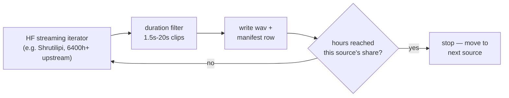

Phase 1 teaches Gemma-3-270M that a stream of Mimi audio tokens carries language +
prosody — see [Data theory](/literature/data-theory) for the full "why 100h isn't
enough" argument. This page is the concrete answer to **where does the data come
from**: real, verified, free sources, streamed on demand by
`scripts/P1_01_fetch_corpus.py`.

<Warning>
**Mozilla Common Voice was removed from Hugging Face on 2026-08-29** and is no longer
part of this mix — see the note right below the table. If you're on an older copy of
this doc or `configs/phase1_corpus.yaml` that still references it, update both.
</Warning>

## The plan

| Language | Target hours | Sources (share of target) |
|---|---|---|
| English | 150h | LibriSpeech (60%) + FLEURS (40%) |
| Hindi | 150h | Kathbath (45%) + Shrutilipi (40%) + FLEURS (15%) |
| Gujarati | 130h | Kathbath (45%) + Shrutilipi (35%) + IndicTTS-Gujarati (20%) |

**Total ≈ 430h**, matching the guide's "en 150h + hi 150h + gu 100-150h ≈ 400-450h"
practical target (Section 7.1) — 100h across three languages (the original v1 number)
is too thin to be robust; this is the re-derived, real number.

<Accordion title="Why Common Voice is gone, and how the mix changed">
`mozilla-foundation/common_voice_17_0` (en 60%, hi 25%, gu 20%) was the original source
for gender-labeled speaker diversity. As of this writing, its HF repo is genuinely
empty — Hugging Face's own notice: *"Effective October 2025, Mozilla Common Voice
datasets are now exclusively available through Mozilla Data Collective."* Not a
gating/token issue — there's no data left in the repo to authenticate into. If you ever
see `failed to open mozilla-foundation/common_voice_.../en: The directory ... doesn't
contain any data files`, that confirms it, no amount of `HF_TOKEN` fixes it.

Fixed per language:
- **en**: Common Voice's 60% replaced with `openslr/librispeech_asr` (public, ~1000h of
  read English speech, no gating) at the same weight.
- **hi** / **gu**: Common Voice's share redistributed proportionally across the
  remaining sources — Kathbath/Shrutilipi/FLEURS were 35/30/10 for hi, now 45/40/15;
  Kathbath/Shrutilipi/IndicTTS-Gujarati were 35/30/15 for gu, now 45/35/20. No
  replacement source needed — Kathbath and Shrutilipi are already large enough to
  absorb it.

Net effect: **the whole default config is now completely ungated** — no `HF_TOKEN`
needed at all to fetch Phase-1 data.
</Accordion>

## Why each source is in the mix

<AccordionGroup>
  <Accordion title="LibriSpeech (OpenSLR)">
    [openslr/librispeech_asr](https://huggingface.co/datasets/openslr/librispeech_asr) —
    ~1000h of public-domain read-English-speech audiobooks, the classic ASR benchmark
    corpus. Public, ungated, verified streamable. No gender field in the HF schema — the
    fetcher's gender-balance step simply skips it for this source (same graceful
    fallback Kathbath/Shrutilipi already needed), so gender balance for English leans on
    FLEURS plus sheer speaker-count diversity in LibriSpeech itself.
  </Accordion>
  <Accordion title="AI4Bharat Kathbath">
    [ai4bharat/Kathbath](https://huggingface.co/datasets/ai4bharat/Kathbath) — 1684h
    across 12 Indian languages, read + spontaneous speech from 1218 contributors in
    203 districts. CC0. This is the "Indian speakers, read+spontaneous" line from
    Section 7.2's source table.
  </Accordion>
  <Accordion title="AI4Bharat Shrutilipi">
    [ai4bharat/Shrutilipi](https://huggingface.co/datasets/ai4bharat/Shrutilipi) —
    6400h+ mined from All India Radio news bulletins across 12 languages. Natural,
    unscripted prosody — exactly the "mined news audio, natural prosody" role from
    Section 7.2.
  </Accordion>
  <Accordion title="Google FLEURS">
    [google/fleurs](https://huggingface.co/datasets/google/fleurs) — small, very
    clean. Doubles as a natural **held-out eval set** (Section 10's evaluation
    corpus can draw from the same FLEURS slice never used in training).
  </Accordion>
  <Accordion title="IndicTTS (SPRINGLab, IIT-Madras)">
    [SPRINGLab/IndicTTS_Gujarati](https://huggingface.co/datasets/SPRINGLab/IndicTTS_Gujarati) —
    studio-quality clean baseline, the "IIT-M IndicTTS" line from Section 7.2. Gujarati
    is the scarcest of the three languages, so this adds a clean anchor on top of the
    noisier Kathbath/Shrutilipi mix.
  </Accordion>
</AccordionGroup>

<Note>
Not in the default mix: [ARTPARK-IISc/Vaani](https://huggingface.co/datasets/ARTPARK-IISc/Vaani) —
31,255h across 165 districts and 106 languages, Section 7.2's "district-level accent
spread" entry. It's enormous relative to what Phase-1 needs, so it's left out by default
to keep Kaggle bandwidth/disk bounded. Add it as an extra `sources:` entry in
`configs/phase1_corpus.yaml` with a small `weight` (0.05-0.10) per language if you want
more accent diversity and have the session budget.
</Note>

## Run it

**Recommended: `scripts/P1_00_pipeline.py`** — runs entirely locally (e.g. your Mac, no
Kaggle session needed for this stage), downloads every language+source concurrently,
and pipelines the rest: the moment a language finishes downloading it's immediately
encoded + frame-built (while the other languages keep downloading), and the moment its
frames are built it's immediately uploaded to Hugging Face in the background:
```bash
pip install datasets soundfile huggingface_hub
export HF_TOKEN=hf_...   # WRITE access — only needed for the upload step, not downloads

python scripts/P1_00_pipeline.py --config configs/phase1_corpus.yaml \
    --hf-repo <your-hf-username>/kupe-thinkspark-270m-phase1-data --dry-run
python scripts/P1_00_pipeline.py --config configs/phase1_corpus.yaml \
    --hf-repo <your-hf-username>/kupe-thinkspark-270m-phase1-data
```
Every stage logs its own timestamped, tagged, color-coded lines (`[DOWNLOAD]` cyan,
`[ENCODE]` yellow, `[FRAMES]` blue, `[UPLOAD]` green, errors bold red — via `rich`, an
existing optional dependency; falls back to identical plain text if `rich` isn't
installed) — safe to watch while several stages run at once. Below the scrolling log, a
pinned live table (redraws every 2s) shows, per language: a tqdm-style download-progress
bar (hours so far / target), how many clips encoded, how many uploaded (to the exact
`--hf-repo` named in the title), and how many raw wavs deleted (disk freed) — plus a
TOTAL row and queue depths. Fully resumable: Ctrl+C any time, re-run the same command,
every stage (download via the manifest, encode via existing `.npz`, upload via a
`hf_sync` SQLite table) picks up exactly where it left off. `--no-upload` runs it purely
locally. Run `--no-upload` first if you just want the corpus without publishing it
anywhere.

Local-only, no upload: `python scripts/P1_00_pipeline.py --config configs/phase1_corpus.yaml --no-upload`

<Warning>
**Real observed bug, now fixed:** opening a source could hang forever with zero output
and `Ctrl+C` not responding (observed on `google/fleurs` specifically — every other
source in the same run opened fine). Root cause: `datasets.load_dataset()` had no
timeout at all, and for script-based datasets like fleurs can block on a hidden
confirmation prompt (`trust_remote_code`) that has nowhere to be answered in a non-
interactive run. Fixed two ways: `trust_remote_code=True` is now passed explicitly (an
official Google dataset — safe), and every `load_dataset()` call now runs under a 120s
watchdog — a genuine hang now raises a clear, retried error instead of blocking forever.
(An earlier version of this fix used a thread pool whose worker thread would itself leak
and block the whole Python process from exiting if the hang were real; verified fixed by
actually reproducing the hang against a fake `load_dataset` and confirming the process
exits cleanly.) Applies to every fetch entry point (`P1_00_pipeline.py`,
`P1_00_sequential.py`, `P1_01_fetch_corpus.py`) since all three share `fetch_source`.

**Follow-up, also fixed:** a NEWER `datasets` version removed `trust_remote_code`
entirely and raises immediately if it's passed at all ("`trust_remote_code` is not
supported anymore") — the opposite problem from the hang above, hit on a real run right
after the first fix landed. Now handled automatically: the first attempt passes
`trust_remote_code=True` (for older versions that need it), and if the installed
`datasets` rejects the kwarg outright, it retries once immediately without it — works
across both old and new `datasets` versions with no manual pinning. Verified offline
against both a version that hangs without the kwarg and one that errors on it.
</Warning>

<Warning>
**Real observed bug, now fixed:** `Uploaded` could stay stuck at 0 for an entire run
with no visible error. Root cause: the upload worker read `HF_TOKEN` from its own
process environment — if that's missing (very commonly on Kaggle/Jupyter: `!export
HF_TOKEN=...` in one notebook cell does **not** persist into a later `!python ...`
cell's subprocess, each `!` line is its own throwaway shell), the whole upload thread
died silently the instant the run started, before printing anything. Downloads/encoding
kept running fine, masking the problem. Fixed: this failure (and every other
upload-setup failure) is now caught, logged loudly and repeatedly (never just once), and
shown as a persistent red warning on the live dashboard — it can no longer fail silently.
Set the token BEFORE launching the script, in the same process: `import os;
os.environ["HF_TOKEN"] = "hf_..."` (or a Kaggle Secret loaded the same way) — not via a
separate `!export` cell.
</Warning>

<Tip>
**Both Kaggle GPUs used automatically** — pass `--devices cuda:0,cuda:1` (or nothing:
auto-detect already picks up every visible CUDA device, so on a 2-GPU Kaggle session
both T4s are used without any flag). Each device gets its own persistent Mimi encoder
instance, and whatever's pending for a language is split round-robin across all of them
and encoded in parallel — real speedup confirmed via an offline test with a mocked
encoder (10 clips split 5/5 across two fake devices, processed concurrently). `--device
cpu` (singular) still forces exactly one device if you ever want that instead.
</Tip>

<Tip>
**One language at a time, for better resource management** (recommended on a
disk/bandwidth-constrained machine like Kaggle) — pass `--lang`. Each command still runs
the full download → encode → upload → delete-old-wavs cycle **gradually as it goes** for
just that one language, so at no point are all three languages' downloads competing for
disk/network/CPU at once:
```bash
python scripts/P1_00_pipeline.py --config configs/phase1_corpus.yaml \
    --hf-repo <your-hf-username>/kupe-thinkspark-270m-phase1-data --min-free-disk-gb 8 \
    --devices cuda:0,cuda:1 --lang en

python scripts/P1_00_pipeline.py --config configs/phase1_corpus.yaml \
    --hf-repo <your-hf-username>/kupe-thinkspark-270m-phase1-data --min-free-disk-gb 8 \
    --devices cuda:0,cuda:1 --lang hi

python scripts/P1_00_pipeline.py --config configs/phase1_corpus.yaml \
    --hf-repo <your-hf-username>/kupe-thinkspark-270m-phase1-data --min-free-disk-gb 8 \
    --devices cuda:0,cuda:1 --lang gu
```
Run them one after another (wait for `en` to print "Phase-1 pipeline complete" before
starting `hi`) — or as three separate Kaggle sessions if you want to split the 12-hour
session limit across languages. Fully resumable and independent per language: stopping
after `en` and coming back later for `hi`/`gu` costs nothing, and re-running the same
`--lang` command again just continues where it left off (same manifest/DB as the
all-languages-at-once run). `--lang en,hi` also works if you want exactly two of the
three together.
</Tip>

**Cleaning up what's on Hugging Face** — deletes everything currently uploaded to
`--hf-repo` (real content, listed from the repo itself) and clears the matching local
`hf_sync` records, so a following run re-uploads cleanly instead of thinking it's all
already there. Local files (`data/encoded`, `data/frames_phase1`, the manifest) are
never touched — only the remote repo and the local sync-tracking DB:
```bash
python scripts/P1_00_pipeline.py --hf-repo <your-hf-username>/kupe-thinkspark-270m-phase1-data --cleanup
```
Asks "type 'yes' to confirm" first, same pattern as every other cleanup in this project.

<Accordion title="Or the STRICT SEQUENTIAL version — one language, 4 separate tqdm bars, nothing overlaps">
`scripts/P1_00_sequential.py` — the opposite scheduling from the pipelined command
above: for one language, DOWNLOAD runs fully to completion first (its own tqdm bar),
THEN ENCODE runs fully (its own bar, split across `--devices` in parallel), THEN UPLOAD
runs fully (its own bar) — on the **main thread**, so a missing `HF_TOKEN` or bad repo
raises immediately and visibly instead of ever being able to die silently in the
background — THEN the now-uploaded local `.npz` are deleted (its own bar) to free disk
before the next language. Nothing starts until the stage before it is 100% done.
```bash
# wipe everything already on the HF repo first (asks to confirm) so you push clean data:
python scripts/P1_00_pipeline.py --hf-repo <your-hf-username>/kupe-thinkspark-270m-phase1-data --cleanup

python scripts/P1_00_sequential.py --config configs/phase1_corpus.yaml \
    --hf-repo <your-hf-username>/kupe-thinkspark-270m-phase1-data --lang en
python scripts/P1_00_sequential.py --config configs/phase1_corpus.yaml \
    --hf-repo <your-hf-username>/kupe-thinkspark-270m-phase1-data --lang hi
python scripts/P1_00_sequential.py --config configs/phase1_corpus.yaml \
    --hf-repo <your-hf-username>/kupe-thinkspark-270m-phase1-data --lang gu
```
Output layout is exactly the training format — no extra step: `data/encoded/<lang>/*.npz`
+ `data/frames_phase1/frames_<lang>.jsonl`, uploaded to `--hf-repo` in that same layout,
ready for `scripts/19_fetch_training_data.py` -> `scripts/06_train_phase1.py` with no
re-encoding. Fully resumable at every stage — same manifest/`.npz`/`hf_sync` checks as
the pipelined version. `--no-upload` skips stages 3-4 (download+encode only).
</Accordion>

<Accordion title="Or the single-source-at-a-time CLI (no concurrency, no HF upload)">
```bash
pip install datasets soundfile

# see the plan without downloading anything:
python scripts/P1_01_fetch_corpus.py --config configs/phase1_corpus.yaml --dry-run

# fetch (resumable — safe to stop and re-run across as many sessions as you need):
python scripts/P1_01_fetch_corpus.py --config configs/phase1_corpus.yaml

# just one language:
python scripts/P1_01_fetch_corpus.py --config configs/phase1_corpus.yaml --lang hi
```
Then encode + build frames yourself, per language:
```bash
for lang in en hi gu; do
  python scripts/00_encode_audio.py --wav-dir "data/phase1_raw/$lang" --out-dir data/encoded
  python scripts/P1_02_build_frames.py --lang "$lang"
done
```
Both entry points share the exact same fetch logic (`thinkspark.phase1_corpus.fetch_source`)
— identical results either way, this one is just simpler/slower for a quick one-off fetch.
</Accordion>

<Note>
No `HF_TOKEN` needed to download — every source in the default config is public and
ungated (see the Common Voice note above for why that changed). `HF_TOKEN` (with WRITE
access) is only needed for `P1_00_pipeline.py`'s upload step, or if you add back a gated
source yourself (`gated: true` in a `sources:` entry).
</Note>

## Fetching this data onto a training machine (Kaggle)

Once uploaded, pull it straight into Kaggle's local `data/` layout — no re-encoding:
```bash
pip install huggingface_hub
python scripts/19_fetch_training_data.py \
    --phase1-repo <your-hf-username>/kupe-thinkspark-270m-phase1-data
```
Lands as `data/encoded/*.npz` + `data/frames_phase1/*.jsonl`, ready to train
(`scripts/06_train_phase1.py`) immediately. See [Full cheatsheet](/commands/cheatsheet)
for fetching Phase-2 in the same command.

## How it stays bounded on Kaggle

<Warning>
**Real observed failure (2026-08-29):** on Kaggle's fast network, concurrent downloads
(~92 clips/sec) vastly outpaced the single Mimi encoder's encode+delete rate (~2
clips/sec). The periodic 90s encode sweep alone couldn't drain a backlog growing that
much faster than it emptied, and the run died with `[Errno 28] No space left on
device` — which then cascaded into every other error in that run's log (download
"System error"s, encode-stage ENOSPC with `ZipFile.__del__` tracebacks): all downstream
symptoms of that one root cause, not separate bugs.

Fixed with **proactive disk-space backpressure**: every ~20 clips written, the fetcher
checks real free disk space (`shutil.disk_usage`) and, if it's under `min_free_disk_gb`
(`configs/phase1_corpus.yaml`, default 5.0GB — comfortable headroom on Kaggle's 57.6GiB
session disk), blocks and polls every 5s until the encoder's wav-delete-after-encode
frees enough room, logging `pausing downloads...` / `still waiting...` /
`disk space recovered...` so it's visible in the run's logs rather than silent. Override
per-run with `--min-free-disk-gb` on either `P1_00_pipeline.py` or
`P1_01_fetch_corpus.py`. This turns "crash once disk fills" into "downloads
self-throttle to encoding speed", regardless of how fast the network or how slow the
encoder is on a given machine.
</Warning>

Every source is opened with `datasets.load_dataset(..., streaming=True)` — nothing
downloads in full. The fetcher stops **per source** the instant its share of the
language's target hours is reached:



So even though Shrutilipi alone is 6400h+, this config only ever pulls the ~45-68h its
`weight` asks for per language — disk and bandwidth stay proportional to what you
actually need, not to the upstream dataset's real size.

## Resumability

`data/phase1_raw/manifest.jsonl` is the source of truth, same pattern as scenario
generation: on restart, already-written clips per (language, source) are skipped —
re-streamed past, not re-saved — and the run continues toward the same target. Safe to
stop and resume across as many Kaggle sessions as it takes.

## Gender balance — why it matters here specifically

<Warning>
The Mimi codec does **not** remove speaker bias — your data distribution does (Section
7.3). Turn-taking cues (final lengthening, pitch fall) sit at different f0 ranges for
different genders/ages. If Phase-1 audio is male-heavy, endpointing gets biased and
clips female/child voices. `gender_balance: true` in `configs/phase1_corpus.yaml`
targets ~50/50 wherever the source provides a gender field. None of the current default
sources carry one reliably (LibriSpeech, Kathbath, Shrutilipi, IndicTTS all lack an
explicit field; FLEURS is small) — the fetcher's gender step gracefully no-ops when a
source has no gender column, so balance here leans on the sheer number/diversity of
speakers across sources rather than an explicit label. Add a source with a real gender
field (via a custom `sources:` entry) if exact 50/50 matters more than that for your run.
</Warning>

<Card title="Next: build frames from what you fetched" icon="waveform-lines" href="/commands/preprocessing">
  Encode to Mimi, then build the Phase-1 frame records.
</Card>
