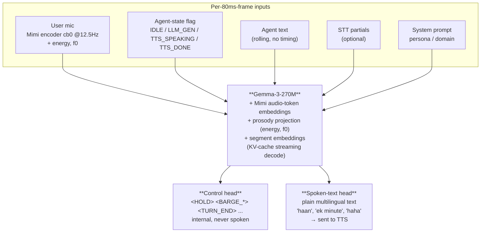
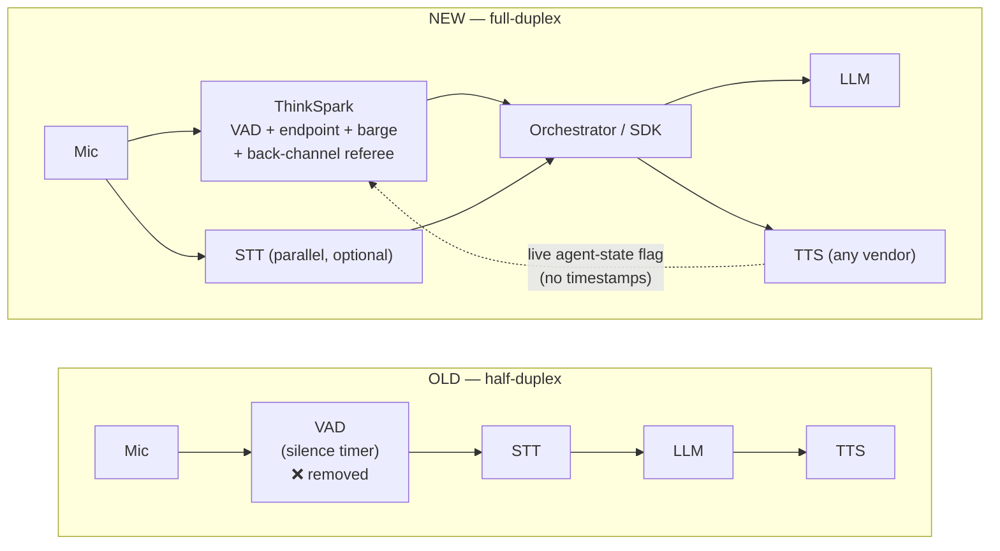

## Why Gemma-3-270M (not vibes)

The model **reads** Indic text (system prompt, agent text, optional STT) and **writes**
Indic back-channel text. So the tokenizer decides everything — a small English-centric
vocab shatters Devanagari/Gujarati into meaningless byte fragments ⇒ long sequences, high
latency, garbage output.

| Candidate | Params | Vocab | Ctx | Indic script? |
|---|---|---|---|---|
| **Gemma-3-270M** ⭐ | 270M | 256K | 32K | ✅ native Devanagari + Gujarati tokens |
| LFM2.5-350M | 350M | 65K | 32K | ❌ fragments Indic |
| SmolLM2-360M | 360M | 49K | 8K | ❌ fragments Indic (v1's mistake) |

<Note>
Most of Gemma-3-270M's parameters sit in the 256K-token **embedding table** (a cheap
lookup) — the actual transformer stack is small (≈100M active). Per-frame decoding is
fast **and** Indic/code-mixed text is handled natively. This is also why it's the
**lowest-latency** choice, not just the most script-aware one.
</Note>

## Full model diagram



## The agent-state channel — the thing that kills vendor lock

At inference we **never** rely on TTS character-timestamps. Instead the orchestrator
tells the model, every frame, a tiny state + the current agent text:

| State | Meaning to the model |
|---|---|
| `IDLE` | nobody on the agent side is talking or thinking (candidate for silence-break) |
| `LLM_GEN` | the LLM is currently producing a reply — **do not** commit another one |
| `TTS_SPEAKING` | audio is playing now (live). Barge decisions matter here |
| `TTS_DONE` | the agent just finished; floor is open |

This single flag replaces the timestamp pointer. On barge, we don't need to know the
exact character reached — we stop TTS and (if the provider gives partial STT of the
agent, or we log our own sent text) hand the last-sent chunk to the LLM. Works with
ElevenLabs, Google, Azure, Sarvam, Soniox — anyone.

<Frame caption="Old vs. new pipeline — the VAD is deleted">

</Frame>

**Removed:** VAD model, fixed-timeout endpointer, naive "any-noise" interrupt.
**Kept:** STT (parallel), LLM, TTS. **Added:** the referee + a live agent-state feedback wire.

## Frame + parameter math you can trust

$$
f = 12.5\text{ Hz} \Rightarrow 1\text{ frame} = 80\text{ ms} \Rightarrow 45{,}000\text{ frames/hour}
$$

- Audio tokens/hour (cb0 only) = 45,000. A 30s training window = 375 audio frames.
- Prompt + agent text (≤ 400 tok) totals ≪ 32K context — plenty of headroom.
- Decode cost per frame ≈ one incremental step over a ~100M active transformer ⇒
  single-digit ms on GPU, ≤ 25 ms on CPU — comfortably inside the 80 ms frame.

## What the model outputs — two heads

### 1. Control head (internal — never spoken)

| Flag | Meaning | Orchestrator action |
|---|---|---|
| `LISTEN` | user has the floor | stay silent |
| `HOLD` | keep current agent audio | continue TTS (also used during `LLM_GEN` to avoid double-invoke) |
| `INCOMPLETE` | user paused, not finished | suppress endpoint; usually paired with a thinking-sound |
| `TURN_END` | user genuinely finished | commit LLM → TTS |
| `BARGE_SOFT` | user started over agent, likely wants floor | duck / lower agent, prepare to stop |
| `BARGE_HARD` | clear interruption | stop TTS immediately, send agent-so-far + user to LLM |
| `CONTINUE` | overlap is only a back-channel | ignore, keep speaking |
| `PREFETCH_LLM` | turn-end likely soon | **speculatively start** LLM now (hide latency) |
| `COMMIT_LLM` | use the prefetched/started reply | play it |
| `CANCEL_LLM` | user kept talking | drop the speculative reply |
| `SILENCE_BREAK` | dead air too long | make the agent re-open the conversation |

### 2. Spoken-text head (plain text → any TTS)

The model writes **short natural phrases as ordinary text** (no brackets), conditioned on
prompt + context + optional STT:

- **Back-channel**: "haan", "achha", "mmm", "right", "saru" (Gujarati), "bilkul".
- **Thinking / continuer** (on incomplete turns): "haan haan, boliye…", "yeah, go on…".
- **Emotive**: "haha", "ohh", "arre wah", a soft "hmm" for empathy.
- **Forceful interrupt**: "ek minute…", "sir, please…", "sorry to cut in…" — escalating.
- **Context re-open** (silence-break): sales → *"So, shall I share the offer?"*;
  support → *"Are you still there?"*.

<Warning>
Bracketed tags (`[laugh]`, `<gasp>`) only work if your TTS understands that exact tag —
that's vendor lock again. Plain words are spoken correctly by **every** TTS, and modern
TTS even renders laughter from the word itself.
</Warning>

## The 8 behaviours, concrete input → output

Notation: `[A]` = one 80 ms user-audio frame.

```
B1 BARGE  in: state=TTS_SPEAKING, agent="aapka EMI due hai teerah..."
              [A][A](user onset: "nahi maine pay kar diya")[A]
        out: <HOLD><HOLD><BARGE_HARD>  (+ optional spoken "ji, boliye")
   negative: user says "haan haan" over agent -> <CONTINUE>  (look-alike, must train both)

B2 BACKCHANNEL  in: state=TTS_DONE/IDLE, user narrating, clause boundary+falling pitch
        out: <LISTEN> + spoken "haan"  (sales tone -> "bilkul sir")

B3 OVERLAP  in: state=TTS_SPEAKING AND user energy present
        out: competitive -> <BARGE_SOFT>/<BARGE_HARD> ; cooperative -> <CONTINUE>

B4 TURN-TAKING  in: "mera number hai nau aath saat [pause 900ms, held pitch] chhah..."
        out: ...<INCOMPLETE>... then <PREFETCH_LLM> as end nears ... <TURN_END><COMMIT_LLM>

B5 CORRECTION  in: "send it to Rahul no to Rohan" (+STT partials if available)
        out: ...<HOLD/INCOMPLETE>...<TURN_END>  flag: prefer latest span (Rohan)

B6 INCOMPLETE+THINKING  in: user trails off, 3 silent frames, no falling tone
        out: <INCOMPLETE> + spoken "haan haan, aap keh rahe the?"

B7 SILENCE_BREAK  in: state=IDLE, user silent, > ~2.5s (>=32 frames)
        out: <SILENCE_BREAK> + spoken context re-open

B8 GATEKEEP  in: state=LLM_GEN, user quiet
        out: <HOLD>  (never a 2nd <COMMIT_LLM>)
```

<Card title="Next: Data theory" icon="database" href="/literature/data-theory">
  How the 400–450h + 55h corpora are built, balanced, and validated.
</Card>
