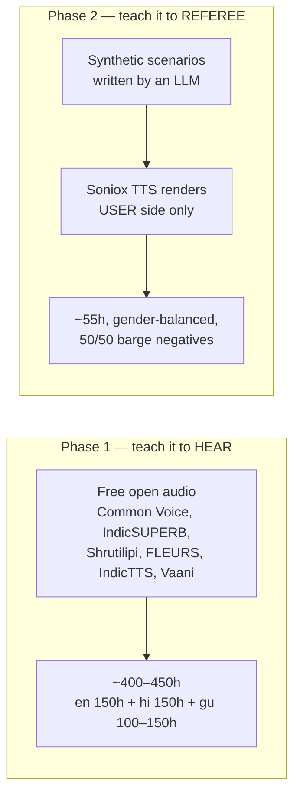
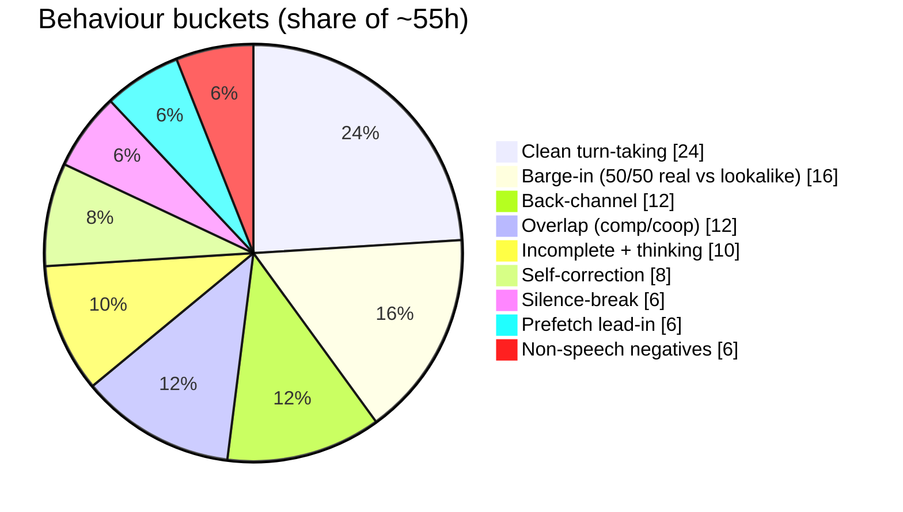
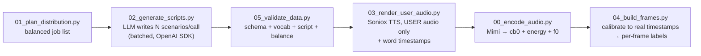
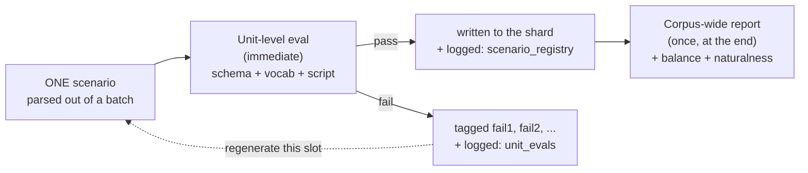

## Two very different corpora

<Note>
**Cost = ₹0 for Phase 1** — only free Kaggle GPU time to encode to Mimi. Speaker count is
already in the thousands ⇒ this is what gives *speaker-invariance*, so the paid Phase-2
set can stay small (~55h).
</Note>

### Is 100h (v1's number) enough? No.

Phase 1 teaches Gemma-3-270M that a stream of Mimi audio tokens carries language +
prosody — close to the academic **Voice Activity Projection (VAP)** task (predict both
speakers' near-future speech), *not* full ASR. Good news: we need less than Whisper's
680k h. But 100h across three languages is too thin to be robust.

VAP-style turn-taking models are trained on Switchboard/Fisher (~260h+). We need *per
language* plus enough phonetic grounding for back-channel/repair cues.
**Target: ≥100–150h per language.** Gujarati is scarce; accept less and up-sample.

### The codec does NOT remove bias — your data distribution does

Mimi preserves speaker/pitch info in its acoustic content. Turn-taking cues (final
lengthening, pitch fall) sit at *different f0 ranges for different genders/ages*. If
Phase-1 is male-heavy, endpointing gets biased and clips female/child voices.
**Fix:** balance gender ≈50/50 and spread ages/accents. Aim ≥500 distinct speakers/language.

<Card title="Where the Phase-1 data actually comes from" icon="globe" href="/commands/phase1-corpus">
  Real, verified HuggingFace sources — Common Voice 17, AI4Bharat Kathbath + Shrutilipi,
  Google FLEURS, IndicTTS — streamed on demand by `scripts/P1_01_fetch_corpus.py`, with
  the exact per-language weights and why each source is in the mix.
</Card>

## Phase-2 distribution (the balanced generation plan)

`thinkspark.distribution` turns a target hour-count into an exact, integer-balanced list
of "generation jobs" — behaviour × language × domain × gender — so the corpus is
balanced **by construction**, not by hoping the LLM cooperates.

| Language slice | Share | Notes |
|---|---|---|
| Hindi (Devanagari) | 30% | native script only |
| English | 26% | — |
| Gujarati (Gujarati script) | 24% | native script only |
| Hindi + English words (native script) | 10% | e.g. *"aaj weather achha hai"* in Devanagari |
| Gujarati + English words (native script) | 10% | e.g. *"aaje meeting chhe"* |

<Warning>
"Mixed" means **native script with real English words inserted** — NOT romanized
Hinglish/Gujlish. Romanized code-mix is rare in real deployments, so it's kept out; native
code-mix is kept at only 10% each so the model never panics on a genuine code-switch.
</Warning>

### The deliberate "say nothing" negative

Always emitting "haan"/"right" on every back-channel opportunity would be **unnatural** —
real listeners often say nothing. `thinkspark.distribution.BACKCHANNEL_SILENCE_SHARE`
(35%) reserves a slice of the `backchannel` bucket where the *correct* label is silence
(`LISTEN`, empty spoken text) — usually because the user is still mid-sentence. Symmetric
to this: `barge_lookalike` is a hard negative where "haan haan" over the agent must
resolve to `CONTINUE`, never a real barge.

## How the data is actually made

Only **user-side audio** is synthesised. The agent side stays text + a state flag, so
zero agent audio is ever generated — and the model never consumes agent audio at train or
test time.

### Batched generation — throughput vs. confusion

Each LLM call asks for `batch_size` (default 12) **distinct** scenarios in one completion
instead of one-at-a-time. This is much faster at a given concurrency budget, but a
small/fast model (DeepSeek-flash-class, Gemma-3-27B-class) asked for too many
structurally-identical JSON objects can:

<Steps>
  <Step title="Repeat near-duplicates">
    Copy-paste the same scenario with one word swapped.
  </Step>
  <Step title="Let facets bleed">
    Language or prosody drifts from one item to the next mid-batch.
  </Step>
  <Step title="Truncate the array">
    If `max_tokens` isn't scaled up with batch size, the JSON gets cut off mid-response.
  </Step>
</Steps>

**Mitigations baked into the prompt + caller:**
1. The batch prompt explicitly demands **distinct** items, forbidding paraphrase-only variation.
2. `max_tokens` scales with `batch_size` so the array is never truncated.
3. Every item is schema-validated **independently** — one bad item never discards a whole
   good batch; only the missing count gets re-requested.

<Tip>
Keep `batch_size ≤ 15` regardless of model. If you see repeats or drift, drop it — `1`
falls all the way back to single-scenario calls (slowest, most reliable).
</Tip>

## Evaluating the generated data — two tiers (before you train on junk)

Section 8.5's checks run at **two points**, not one:

**Tier 1 — unit-level, per scenario, continuous.** The instant a scenario is parsed out
of a batch response, it runs through schema + vocab + script validation. A fail gets an
incrementing, job-scoped tag (`fail1`, `fail2`, …) and the caller regenerates that exact
slot — this is what makes "one bad item never discards a whole good batch" (mentioned
above) actually true. Every check, pass or fail, is logged to SQLite (`unit_evals` +
`scenario_registry` — see [Monitoring & cost](/commands/monitoring-cost)) so you can watch
it live or query it after the fact.

**Tier 2 — corpus-wide, once, at the end.** After a run finishes, the same schema/vocab/
script checks run again over the *whole* shard, plus the two checks that only make sense
at the corpus level:

| Check | How | Pass bar |
|---|---|---|
| Schema valid | JSON parse + field/enum check | ≥ 99% |
| Vocab compliance | flags ∈ fixed set; no brackets in spoken_text | 100% |
| Language/script correct | fastText/langid + Unicode-block check | ≥ 98% |
| Balance | count per behaviour/lang/gender | within ± 2% of target |
| Naturalness | LLM-judge 1–5 on spoken_text | mean ≥ 4.2 |

<Tip>
Unit-level eval catches a bad scenario the moment it happens — cheap, fast, no LLM-judge
cost. Corpus-level eval catches things no single scenario can reveal on its own —
**balance** (is the whole corpus still the planned 30/26/24/10/10 language split?) and
**naturalness trend** (sampled LLM-judge over hundreds of scenarios). You want both.
</Tip>

<Card title="Next: Training theory" icon="brain" href="/literature/training-theory">
  Exact loss functions, phases, and the 2×T4 VRAM budget.
</Card>
