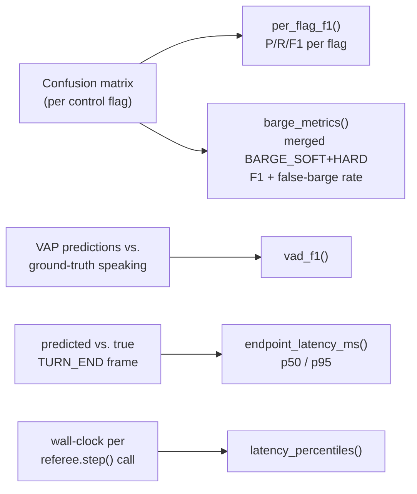

## Definitions

$$
P = \frac{TP}{TP+FP}, \qquad R = \frac{TP}{TP+FN}, \qquad F1 = \frac{2PR}{P+R}
$$

$$
\text{cutoff rate} = \frac{\#\text{turns ended while user not done}}{\#\text{turns}}
$$

Latency is always reported as **median (p50)** and **95th percentile (p95)**.

## The target table

| Phase / behaviour | Metric | Target |
|---|---|---|
| Phase 1 | perplexity; frame VAD-F1 (held-out CER, grounding proxy) | VAD-F1 ≥ 0.85 |
| Barge-in | precision/recall/F1; **false-barge rate** (barging on back-channels) | F1 ≥ 0.85, false-barge ≤ 5% |
| Endpointing | turn-end F1; **cutoff rate**; endpoint latency p50/p95 | cutoff ≤ 3%, p95 ≤ 300 ms |
| Back-channel | LLM-judge appropriateness; over-trigger rate | judge ≥ 4.2, over-trig ≤ 8% |
| Prefetch | useful-prefetch % vs. wasted-prefetch % (cost) | useful ≥ 70% |
| Silence-break | trigger precision (only true dead air) | ≥ 0.9 |
| Latency | referee decode p50/p95 (ms) | p95 ≤ 40 ms |

<Warning>
**False-barge rate** is the one metric that most directly measures "does it interrupt on
a mere back-channel?" — this is exactly what the `barge_lookalike` hard-negative bucket in
the training data exists to suppress. If false-barge is high, check that bucket's balance
first before touching hyperparameters.
</Warning>

## How the metrics map to code

`thinkspark.metrics.check_targets()` runs every result against the table above and
returns a pass/fail dict — that's what `scripts/08_evaluate.py` prints.

## Reading a per-flag F1 report

A healthy Phase-2 checkpoint typically looks like this (illustrative, not a guarantee):

| Flag | Precision | Recall | F1 | Note |
|---|---|---|---|---|
| `LISTEN` | high | high | high | the common case — easiest to learn |
| `HOLD` | high | high | high | — |
| `TURN_END` | ≥0.85 | ≥0.85 | ≥0.85 | directly gates perceived latency |
| `BARGE_HARD` | ≥0.85 | ≥0.85 | ≥0.85 | rare — focal loss is doing its job here |
| `PREFETCH_LLM` | moderate | moderate | moderate | trades false-starts vs. hidden latency |
| `SILENCE_BREAK` | ≥0.9 precision | — | — | false triggers are annoying, so precision matters most |

<Tip>
If a rare flag (`BARGE_HARD`, `CANCEL_LLM`, `SILENCE_BREAK`) has low recall, first check
`thinkspark.losses.class_alpha_from_freq` picked up the real class frequency from your
actual frame shards — not a stale count from an earlier, smaller data run.
</Tip>

<Card title="Next: Inference theory" icon="bolt" href="/literature/inference-theory">
  The live referee loop, prefetch, and why it feels instant.
</Card>
