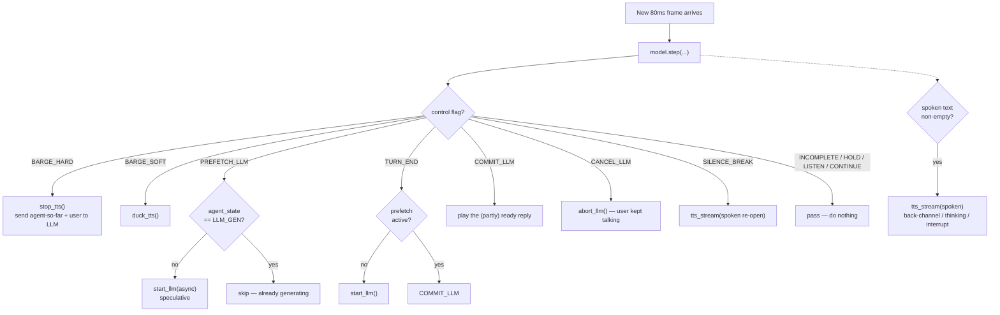
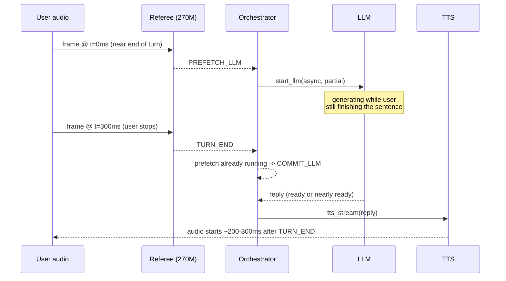

## The per-frame loop

Every 80 ms, the referee sees one new audio frame and the orchestrator's current state,
and returns a decision:

```
every 80ms frame:
  tok, e, f0 = mimi_stream_encode(mic_frame)
  st = agent_state()   # IDLE|LLM_GEN|TTS_SPEAKING|TTS_DONE   (NO timestamps)
  flag, spoken = model.step(prompt, st, agent_text, stt_partial?, tok, e, f0)

  match flag:
    BARGE_HARD    : stop_tts(); send_to_llm(agent_text_sent_so_far, user_turn)
    BARGE_SOFT    : duck_tts()
    PREFETCH_LLM  : if st != LLM_GEN: start_llm(async, user_partial)  # hide latency
    COMMIT_LLM    : reply = await_llm(); tts_stream(reply)             # any vendor
    CANCEL_LLM    : abort_llm()
    TURN_END      : if no prefetch: start_llm(); else COMMIT
    SILENCE_BREAK : tts_stream(spoken or llm_reopen())
    INCOMPLETE|HOLD|LISTEN|CONTINUE : pass

  if spoken: tts_stream(spoken)   # back-channel / thinking / forceful-interrupt
```

## Decision flow as a diagram



## Latency — why it feels instant

Naïve cascade on turn-end:

$$
t_{\text{VAD wait}}(600) + t_{\text{LLM}}(400\text{–}800) + t_{\text{TTS}}(200) \approx 1.2\text{–}1.6\text{s}
$$

Ours — prefetch fires ~300–500 ms **before** the user finishes, so at `TURN_END` the LLM
reply is (partly) already ready:

$$
\text{perceived reply} \approx t_{\text{referee}}(\le 40) + t_{\text{TTS first chunk}}(\le 200) \approx 0.2\text{–}0.3\text{s}
$$

Back-channels are ≤ 120 ms — no LLM involved at all, since they come straight off the
spoken head.



## How it compares to a true full-duplex model

| Scenario | PersonaPlex/Moshi (E2E) | ThinkSpark |
|---|---|---|
| Barge-in latency | ~70 ms | ~100–160 ms (great in practice) |
| Back-channel | native | ✅ native (spoken-text head) |
| Answer correctness | model-generated (can hallucinate) | ✅ your governed LLM |
| Hindi/Gujarati | weak | ✅ your Indic stack |
| Swap TTS vendor | ❌ baked in | ✅ any vendor (flag-based) |
| GPU to run | 7B / A100 | 270M / CPU-ok |
| Auditable | ❌ | ✅ |

<Card title="Now go run it" icon="terminal" href="/commands/setup">
  Switch to the **Commands** tab for the exact copy-paste run-book, start to finish.
</Card>
