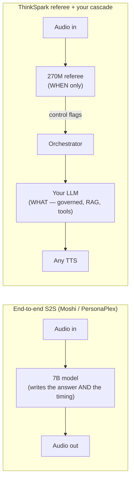

## The problem: your pipeline is a walkie-talkie

Kupe's production stack is a **cascade**: `VAD → STT → LLM → TTS`. It's loved because
every block is swappable, auditable, and cheap. But it is **half-duplex** — only one side
holds the floor at a time, and the hand-off is triggered by a dumb silence timer inside
the VAD. That single timer causes every complaint users have:

<CardGroup cols={3}>
  <Card title="Cuts people off" icon="scissors">
    Fires during a thinking pause — "my number is 987… ___ …654".
  </Card>
  <Card title="Awkward lag" icon="hourglass">
    Waits a fixed 600–800 ms after **every** turn, even obvious ones.
  </Card>
  <Card title="Deaf while speaking" icon="ear-off">
    Can't say "haan / achha" while the user talks. Can't be interrupted cleanly.
  </Card>
</CardGroup>

A human conversation is **full-duplex** — both people listen and react at the same time.
A plain cascade does none of that; an end-to-end speech-to-speech model (Moshi,
PersonaPlex) does, but throws away your governed LLM.

## The 8 behaviours that make an agent feel full-duplex

| # | Behaviour | What it looks like |
|---|---|---|
| B1 | **Barge-in** | Stop instantly when interrupted |
| B2 | **Back-channel** | "mhm", "haan" while listening |
| B3 | **Overlap / cross-talk** | Both talk — who yields? |
| B4 | **Dynamic turn-taking** | Endpoint by *prosody*, not a fixed timer |
| B5 | **Mid-sentence correction** | "send to Rahul… no, Rohan" |
| B6 | **Thinking-sounds** | On incomplete turns — keeps the floor open |
| B7 | **Dead-air breaker** | Re-open the conversation after long silence |
| B8 | **Forceful interrupt** | "ek minute… sir, please…" |

## The big idea: a referee, not a new player

A full-duplex speech-to-speech model secretly does **two jobs** at once: (1) **when** to
talk (floor control) and (2) **what** to say (content). ThinkSpark rips out only job (1)
into a small, fast, auditable model and leaves job (2) with your own Indic LLM + any TTS.

<Tip>
The referee never invents the actual answer — your LLM still does that. It only decides
**when** to speak, listen, or interject. That's the one thing a normal pipeline can't do.
</Tip>

## Why not just use an end-to-end model?

| | End-to-end S2S (Moshi / PersonaPlex-7B) | ThinkSpark (270M referee + your cascade) |
|---|---|---|
| Who writes the answer | the model (opaque) | ✅ your own LLM (RAG, tools, compliance) |
| Indic hi/gu quality | weak (English-centric) | ✅ your own Indic STT/TTS/LLM |
| Cost to run | 7B, A100/4090, self-host | ✅ 270M, runs on a CPU / tiny GPU |
| Auditable (BFSI) | ❌ spoken content generated inside | ✅ every word is your LLM's, logged |
| Vendor lock | — | ✅ works with *any* TTS |
| Micro-timing | state-of-the-art (~70 ms) | very good (~100–160 ms), one part to tune |

## What changed from v1 → v2 (11 objections resolved)

The v1 write-up had 11 real gaps. Each is a concrete engineering fix in v2:

<AccordionGroup>
  <Accordion title="1-3, 8 — vendor lock via TTS timestamps">
    Timestamps are used **only during data generation**. At inference we feed a live
    "agent-speaking" flag + the agent's own text — no timing dependency on any TTS
    vendor. See [Architecture → Agent-state channel](/literature/architecture).
  </Accordion>
  <Accordion title="2, 5 — emotions/back-channels must be plain speakable text">
    Two output heads: **control flags** (internal, bracketed) + **spoken text** (plain,
    sent straight to TTS). No `[laugh]` / `<gasp>` tags that only some vendors understand.
  </Accordion>
  <Accordion title="4, 6 — incomplete turns and dead air">
    `INCOMPLETE` + a generated filler ("haan haan, boliye…") on trailing-off turns;
    `SILENCE_BREAK` after N idle frames re-opens the conversation.
  </Accordion>
  <Accordion title="7 — pre-warming the LLM to hide latency">
    Speculative `PREFETCH_LLM → COMMIT_LLM / CANCEL_LLM` — the reply starts generating
    *before* the user finishes, and is thrown away if they keep talking.
  </Accordion>
  <Accordion title="9, 10 — data balance and hard negatives">
    50/50 real-barge vs. look-alike-backchannel negatives; explicit native-script splits
    for hi/en/gu + code-mixed slices (never romanized).
  </Accordion>
  <Accordion title="11 — is 100h of data enough?">
    No. Re-derived to ~300–450h free pre-train + ~50–60h synthetic fine-tune,
    gender-balanced, fitting a ₹5000 budget on Kaggle 2×T4.
  </Accordion>
</AccordionGroup>

<Card title="Next: Architecture" icon="sitemap" href="/literature/architecture">
  See the actual model diagram, the two output heads, and why Gemma-3-270M.
</Card>
