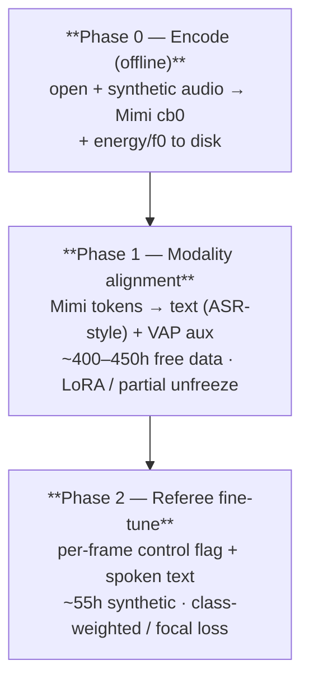
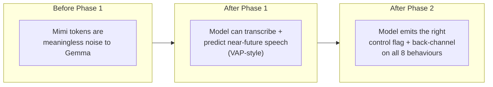

## Three phases

## Loss functions (exact)

### Phase 1 — alignment + turn-taking

$$
\mathcal{L}_{\text{align}} = -\frac{1}{T}\sum_t \log p(w_t \mid \text{audio}, w_{\lt t}), \qquad
\text{perplexity} = e^{\mathcal{L}_{\text{align}}}
$$

VAP auxiliary (BCE over $H$ future 80ms bins of "is user speaking"):

$$
\mathcal{L}_{\text{vap}} = -\frac{1}{H}\sum_h \big[y_h \log\sigma(z_h) + (1-y_h)\log(1-\sigma(z_h))\big]
$$

$$
\mathcal{L}_{P1} = \mathcal{L}_{\text{align}} + \lambda_{\text{vap}} \mathcal{L}_{\text{vap}}, \qquad \lambda_{\text{vap}} \approx 0.3
$$

### Phase 2 — referee (handles class imbalance)

Flags are hugely imbalanced (`LISTEN`/`HOLD` dominate; `BARGE_HARD` is rare). We use
**focal loss** on the control head:

$$
\mathcal{L}_{\text{ctrl}} = -\frac{1}{N}\sum_i \alpha_c (1-p_{i,c})^{\gamma} \log p_{i,c},
\qquad \gamma = 2,\ \ \alpha_c \propto \frac{1}{\sqrt{\text{freq}_c}}
$$

Spoken head = plain cross-entropy $\mathcal{L}_{\text{txt}}$ on the interjection tokens
(masked to spoken spans only):

$$
\mathcal{L}_{P2} = \lambda_1 \mathcal{L}_{\text{ctrl}} + \lambda_2 \mathcal{L}_{\text{txt}} + \lambda_3 \mathcal{L}_{\text{vap}},
\qquad (\lambda_1,\lambda_2,\lambda_3) = (1.0,\ 0.5,\ 0.2)
$$

<Info>
`thinkspark.losses.class_alpha_from_freq` computes $\alpha_c$ straight from the observed
control-flag frequencies in your frame shards — no manual tuning needed.
</Info>

## Does 35h fine-tune suffice? Bumped to ~55h

35h was thin for 8 behaviours × 5 language slices × pos/neg. At 55h with heavy
augmentation and 50/50 barge negatives, each behaviour gets ≥ 3h/language — enough for a
strong v1. Scale later for production.

## VRAM budget, full fine-tune, bf16

Weights $270M \times 2\text{B} = 0.54\text{GB}$; grads $0.54$; AdamW states (fp32 $m,v$)
$\approx 2.16$; master copy $1.08 \Rightarrow \approx \mathbf{4.3\text{GB}}$ + activations.

<Steps>
  <Step title="Gradient checkpointing">
    With seq ≤ 1K, batch 8–16 fits **one T4** (16 GB).
  </Step>
  <Step title="DDP across 2×T4">
    Doubles throughput. LoRA (Phase 1) needs < 2 GB.
  </Step>
  <Step title="Kaggle session math">
    9h/session, ~30h/week. Plan ⇒ Phase 0 encode: 2–3 sessions; Phase 1: 3–4 sessions;
    Phase 2: 2 sessions. Comfortably within weekly quota.
  </Step>
</Steps>

## Hyperparameters (starting point)

| | Phase 1 | Phase 2 |
|---|---|---|
| Optimizer | AdamW, wd 0.1 | AdamW, wd 0.1 |
| LR | 2e-4 (cosine) | 1e-4 (cosine) |
| Warmup | 3% steps | 3% steps |
| Precision | bf16 + grad-ckpt | bf16 + grad-ckpt |
| Batch (eff.) | 32–64 (accum) | 32–64 (accum) |
| Seq len | 1024 | 1024 |
| Epochs | 1–2 | 3–5 |
| Frame drop-aug | 5% (robustness) | 5% (robustness) |
| Adapter | LoRA / partial unfreeze | full fine-tune |

## What each phase actually learns

<Card title="Next: Evaluation theory" icon="chart-line" href="/literature/evaluation-theory">
  How you actually know it works — every metric and its target.
</Card>
